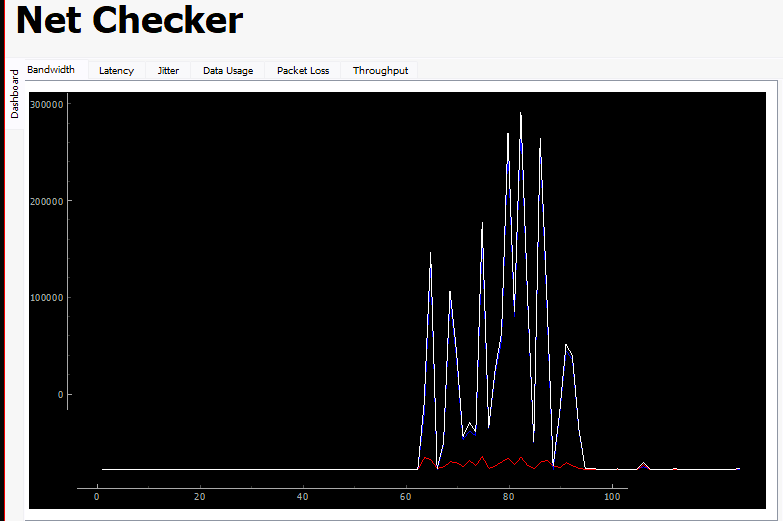

# NET-Checker
Python-Based Network Monitoring Tool

## 📌 Introduction
The **Network Checker Tool** is a Python-based application designed to monitor and analyze network performance. It features a **PyQt5** front-end and utilizes **Matplotlib** for real-time data visualization. This tool helps users diagnose network issues by measuring key network parameters.

## 📊 Key Features
- ✅ **User-friendly GUI** with PyQt5
- ✅ **Real-time data visualization** using Matplotlib
- ✅ **Comprehensive network diagnostics**
- ✅ **Easy to use and lightweight**

## 📡 Network Parameters Monitored
1. **Bandwidth** – Measures network speed and capacity.
2. **Latency** – Determines network delay.
3. **Jitter** – Analyzes packet delay variation.
4. **Data Usage** – Monitors data consumption.
5. **Packet Loss** – Detects lost packets in transmission.
6. **Throughput** – Evaluate actual data transfer rates.

## 🖥️ Screenshots
Here are some previews of the Network Checker Tool in action:

### 📌 Main Interface

## 📌 How It Works
1. **Launch the application** and select the parameters to monitor.
2. **View real-time graphs** for each network parameter.
3. **Analyze results** to detect potential issues.
4. **Optimize your network performance** based on insights.

## 🛠 Technologies Used
- **Python** – Core programming language
- **PyQt5** – GUI development
- **Matplotlib** – Data visualization
- **Scapy** / **Speedtest-cli** – Network performance measurement

## 📬 Contact
For any inquiries or support, reach out via:
- 📧 Email: your-kosaladeshan123@gmail.com
- 🔗 GitHub: [Your GitHub Profile](https://github.com/kosaladeshan)

🚀 **Happy Monitoring!**

